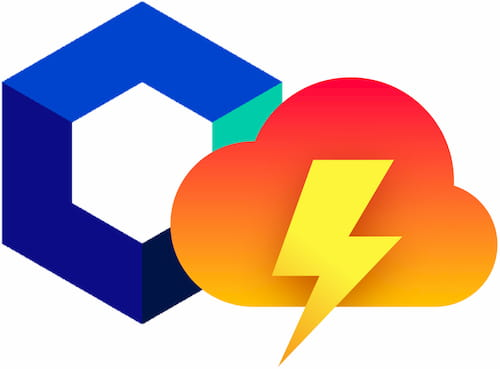

# corvid-storeon




A tiny event-based state manager [Storeon](https://github.com/storeon/storeon) for [Corvid](https://www.wix.com/corvid) by Wix.

## How to use
You can use demo template to try corvid-storeon

- Wix Website Template: [Open In Editor](https://editor.wix.com/html/editor/web/renderer/new?siteId=d6003ab4-7b91-4fe1-b65e-55ff3baca1f4&metaSiteId=654936ba-93bc-4f97-920a-c3050dd82fe7)

## Example

**public/store.js**
```js
import { createStore } from "corvid-storeon";

const counter = (store) => {
  store.on("@init", () => ({ count: 0 }));
  store.on("increment", ({ count }) => ({ count: count + 1 }));
};

export const { getState, dispatch, connect, connectPage } = createStore([counter]);
```

**Page Code**
```js
import { dispatch, connect, connectPage } from "public/store.js";

// Subscribe for state property "count".
// The callback function will be run when the page loads ($w.onReady())
// and each time when property "count" would change.
connect("count", ({ count }) => {
  $w("#text1").text = String(count);
});

// Wrapper around $w.onReady()
// The callback function will be run once.
connectPage((state) => {
  $w("#button1").onClick(() => {
    // Emit event
    dispatch("increment");
  });
});
```

## API

### createStore
The APIs for creating modules the same as [Storeon Store](https://github.com/storeon/storeon#store)

```js
const { getState, dispatch, connect, connectPage } = createStore(modules);
```
- `createStore(Array<Module>): Store`

### getState
will return current state.
```js
const state = getState();
```
- `getState(): object`

### dispatch
will emit an event with optional data.
```js
dispatch("event/type", { value: 123 });
```
- `dispatch(event: string, [data: any]): void`

### connect
connect to state by property key. Will return function disconnect from the store.
```js
const disconnect = connect("key", (state) => { });

disconnect();
```
- `connect(key: string, handler: ConnectEventHandler): Disconnect`
- `callback ConnectEventHandler(state: object): void`
- `function Disconnect(): void`

### connectPage
Sets the function that runs when all the page elements have finished loading. (wrapper around `$w.onReady()`)
```js
connectPage((state) => { });
```
- `connectPage(initFunction: ReadyHandler): void`
- `callback ReadyHandler(state: object): void`

## License
[MIT](./LICENSE)
