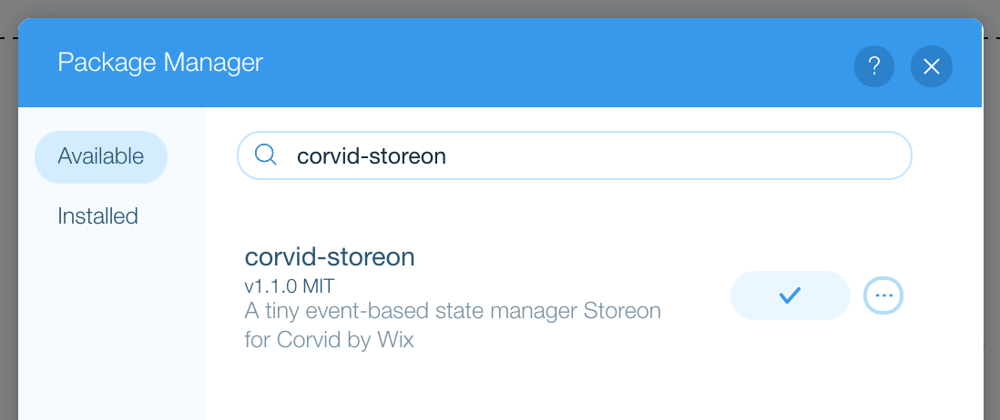

# corvid-storeon

[](https://github.com/shoonia/corvid-storeon/actions)
[](https://www.npmjs.com/package/corvid-storeon)

<a href="https://www.wix.com/alexanderz5/corvid-storeon">
  
</a>

A tiny event-based state manager [Storeon](https://github.com/storeon/storeon) for [Corvid](https://www.wix.com/corvid) by Wix.

## How to use

You can use demo template or install from Package Manager.

- Wix Website Template: [Open In Editor](https://editor.wix.com/html/editor/web/renderer/new?siteId=d6003ab4-7b91-4fe1-b65e-55ff3baca1f4&metaSiteId=654936ba-93bc-4f97-920a-c3050dd82fe7)
- Install: [Package Manager](#install)

## Example

**`public/store.js`**

```js
import { createStore } from "corvid-storeon";

const counter = (store) => {
  store.on("@init", () => ({ count: 0 }));
  store.on("increment", ({ count }) => ({ count: count + 1 }));
};

export const { getState, dispatch, connect, connectPage } = createStore([counter]);
```

**`Page Code`**

```js
import { dispatch, connect, connectPage } from "public/store.js";

// Subscribe for state property "count".
// The callback function will be run when the page loads ($w.onReady())
// and each time when property "count" would change.
connect("count", ({ count }) => {
  $w("#text1").text = String(count);
});

// Wrapper around $w.onReady()
// The callback function will be run once.
connectPage((state) => {
  $w("#button1").onClick(() => {
    // Emit event
    dispatch("increment");
  });
});
```

## Install

You use the [Package Manager](https://support.wix.com/en/article/corvid-managing-external-code-libraries-with-the-package-manager) to manage the npm packages in your site.

Latest available version: `v1.1.0`



## API

### createStore

It creates the store and returns 4 methods for work with the app state. [Store API](#store)

```js
const { getState, dispatch, connect, connectPage } = createStore(modules);
```

- `createStore(Array<Module>): Store`

### getState

will return current state.

```js
const state = getState();
```

- `getState(): object`

### dispatch

will emit an event with optional data.

```js
dispatch("event/type", { value: 123 });
```

- `dispatch(event: string, [data: any]): void`

### connect

connect to state by property key. It will return function disconnect from the store.

```js
const disconnect = connect("key", (state) => { });

disconnect();
```

You can connect for multiple keys, the last argument must be a function.

```js
connect("key1", "key2", (state) => { });
```

- `connect(key: string, [key: string, ...], handler: ConnectEventHandler): Disconnect`
- `callback ConnectEventHandler(state: object): void`
- `function Disconnect(): void`

### connectPage

Sets the function that runs when all the page elements have finished loading. (wrapper around `$w.onReady()`)

```js
connectPage((state) => { });
```

- `connectPage(initFunction: ReadyHandler): void`
- `callback ReadyHandler(state: object): void`

## Store

The store should be created with `createStore()` function. It accepts a list of the modules.

Each module is just a function, which will accept a store and bind their event listeners.

```js
import wixWindow from "wix-window";
import { createStore } from "corvid-storeon";

// Business logic
function appModule(store) {
  store.on("@init", () => {
    return {
      items: [],
    };
  });

  store.on("items/add", ({ items }, item) => {
    return {
      items: items.concat(item),
    };
  });
}

// Devtools
function logger(store) {
  store.on("@dispatch", (state, [event, data]) => {
    if (event === "@changed") {
      const keys = Object.keys(data).join(', ');
      console.log(`changed ${keys}`, state);
    } else if (typeof data !== "undefined") {
      console.log(`action ${event}`, data);
    } else {
      console.log(`action ${event}`);
    }
  });
}

export default createStore([
  appModule,
  (wixWindow.viewMode === "Preview" && logger),
]);
```

The store has 3 methods:

- `store.get()` will return current state. The state is always an object.
- `store.on(event, callback)` will add an event listener.
- `store.dispatch(event, data)` will emit an event with optional data.

## Events

There are 4 built-in events:

**`@init`**

will be fired in `createStore()`. The best moment to set an initial state.

```js
store.on("@init", () => {});
```

**`@ready`**

> Added in: v2.0.0

It will be fired in `$w.onReady()` when all the page elements have finished loading.

```js
store.on("@ready", (state) => {});
```

**`@dispatch`**

It will be fired on every new action (on `store.dispatch()` calls and `@changed` event). It receives an array with the event name and the event’s data. Can be useful for debugging.

```js
store.on("@dispatch", (state, [event, data]) => {});
```

**`@changed`**

It will be fired when any event changes the state. It receives object with state changes.

```js
store.on("@changed", (state, data) => {});
```

You can dispatch any other events. Just do not start event names with `@`.

### Reducers

If the event listener returns an object, this object will update the state. You do not need to return the whole state, return an object with changed keys.

```js
// users: {} will be added to state on initialization
store.on("@init", () => {
  return { users:  { } };
});
```

Event listener accepts the current state as a first argument and optional event object as a second.

So event listeners can be a reducer as well. As in Redux’s reducers, you should change immutable.

```js
store.on("products/save", ({ products }, product) => {
  return {
    users: { ...products, [product._id]: product };
  }
});
```

```js
$w("#buttonAdd").onClick(() => {
  dispatch("products/save", {
    _id: uuid(),
    name: $w("inputName").value,
  });
})
```

### Unbind listener

`store.on()` returns cleanup function. This function will remove the event listener.

```js
const unbind = store.on("@changed", () => {/*...*/});

unbind();
```

### Async operations

You can dispatch other events in event listeners. It can be useful for async operations.

```js
store.on("products/add", async (_, name) => {
  try {
    const product = await wixData.save("Products", { name });

    store.dispatch("products/save", product);
  } catch (error) {
    store.dispatch("errors/database", error);
  }
});
```

## License

[MIT](./LICENSE)
